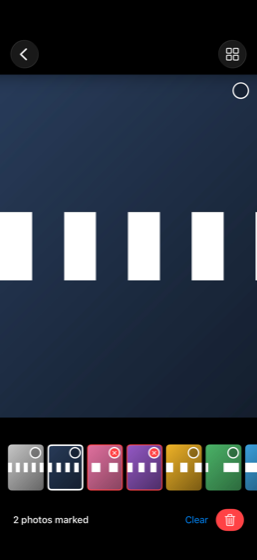
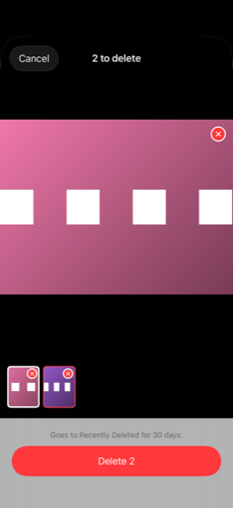

# Cull

**Quick reorganizing and deleting for your camera roll.**

You shot forty photos of the same outfit. Cull lets you page through them full-screen,
tap out the rejects, file the keepers into albums, and delete the rejects in one batch —
in a few gestures, without ever leaving the photo you're looking at.

Personal iOS app (iOS 17+, SwiftUI + PhotoKit). Never shipped, never sold.

<p align="center">
  
  &nbsp;&nbsp;
  
</p>
<p align="center"><sub>Screenshots use synthetic test photos.</sub></p>

## What makes it quick

### Double-tap to mark for delete — no swiping to delete

Most cleanup apps make *swipe* the delete gesture. That has a cost: the swipe gives you no
proper look at the photo, which is exactly wrong when you're culling a **burst** of
near-identical shots. Every swipe is a decision you made in half a second.

In Cull, **swiping only ever moves between photos.** It never marks, files, or deletes, so
paging back and forth is always free and a stray swipe can never cost you a photo.

Marking a photo for deletion is a deliberate, simple motion instead:

- **Double-tap** the photo to mark it. Double-tap again to un-mark.
- Or tap the **circle** on the photo — or on its thumbnail in the filmstrip, right where
  your thumb already is.

You get the full-size photo to judge, and a light touch to decide.

### Hold to file into albums

**Press and hold** a photo and a small card appears in the middle of the screen. Tap an
album and the photo is filed — instantly, with no system prompt — and the card closes. The
photo stays visible behind it the whole time, so you never lose your place.

Filing and marking never fight: **filing a photo clears any delete mark on it**, because
filing means keeping. A photo can't be both saved and queued for deletion.

### Reorder freely to compare tiny details

Choosing between two nearly identical photos is really a question about tiny details — a
blink, a half-second of expression, a slightly sharper edge. So the filmstrip under the
photo isn't just navigation:

- **Hold a thumbnail and drag it** next to the one you're weighing it against.
- Swipe between them, full-screen, to compare.
- Rearrange as many times as you like; the order is yours, and reordering never changes
  *which* photos are in play or whether any is marked.

The delete preview uses the same filmstrip, so you can compare one last time before you
commit.

### Delete once, safely

- Marking is **local state only**. Nothing is deleted until you open the delete preview and
  press **Delete** — one confirmation for the whole batch, however many photos.
- Deleted photos land in **Recently Deleted for 30 days**, which is what makes aggressive
  culling feel safe.
- Your marks **survive an accidental swipe out of review**, and the same goes for your
  selection in the grid.

## Also

- **Tap a photo** in the library to open it, like the Photos app. **Select** turns tapping
  into picking a group; drag sideways to sweep a run.
- **Custom Review** picks a time range — last week, last month, last 3 months — so a cull
  starts from what you shot recently, not your whole library.
- Grouping is **manual by design**: no Vision, no similarity thresholds. You know which
  photos belong together. See [`docs/DECISIONS.md`](docs/DECISIONS.md).

## Build and run

Requires Xcode (developed against Xcode 26 / iOS 26 SDK), iOS 17+ deployment target.

```bash
open Cull/Cull.xcodeproj
```

Set your own signing team in Xcode first — the project ships with the author's team ID and
bundle id `com.uyen.Cull`, which you'll want to change.

### Tests

The decision logic — marking, filing, ordering, reordering, date ranges — lives in
`CullCore`, a Swift package with no Apple UI or media frameworks, so every rule that can
lose a photo is verified with no simulator or device:

```bash
cd CullCore && swift test
```

## Status

The core logic is unit-tested (61 tests). The UI has been exercised in the iOS Simulator
with seeded photos.

**The Simulator cannot stand in for a real library:** it can't be granted photo access by
script, so actual filing, actual deletion, and the feel of the drag are checked by hand on a
device. That checklist is [`docs/DEVICE-TESTS.md`](docs/DEVICE-TESTS.md), and nothing in it
is ticked until it has been run.

Not built yet: burst capture in-app and editing.

## Project layout

```
CullCore/        pure decision logic + tests (swift test)
Cull/            the iOS app — PhotoKit wrappers, SwiftUI views
docs/            ARCHITECTURE, DECISIONS (append-only, with reasons), DEVICE-TESTS
CLAUDE.md        the invariants and platform facts every contributor inherits
```

The invariants that matter most: `deleteAssets` is called from exactly one file
(`BatchDelete.swift`); swiping never mutates marks; filing clears the delete mark; original
assets are never modified in place. They're spelled out in [`CLAUDE.md`](CLAUDE.md).
